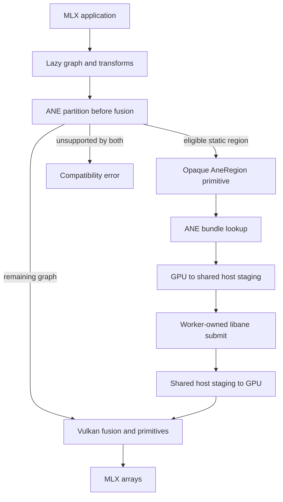

# Architecture

## Goal

Existing MLX Python and C++ graph code must run on M1 Linux without a Metal layer.
The Omarchy GPU provides the full tensor backend through Vulkan.
The ANE can replace supported static graph regions after numerical and performance gates pass.

The CPU may schedule commands, copy buffers, tokenize input, and serve requests.
It must not evaluate tensor primitives in a release build.

## Offline assistant application

The application lives in `serve/mlx_omarchy_assistant/`. The browser and terminal use one authenticated loopback coordinator.
The coordinator owns conversation IDs, ordered events, opt-in history, cancellation, and generated-component validation.
PairManager prepares pinned chat and converted Laya artifacts, then reserves both workers through the existing memory ledger.
Each worker inherits a lifetime pipe. Reservations remain until the manager verifies process exit.

The shared GPU admission lock serializes generation, dictation, synthesis, setup, and transfer activation.
The coordinator parks chat generation at a real decode boundary and hands the GPU lock to one queued speech request between chunks (mlx_omarchy_assistant.speech_yield + the pinned-server yield gate).
A persistent synthesis worker returns PCM chunks over a pipe; the HTTP layer streams them to the browser.
Recognition uses a bounded subprocess and retains the installed Parakeet fixture route.

Sizing searches token counts against byte-based memory admission and declared model limits.
Missing backend qualification imposes an explicit unqualified cap; it does not create a ready recommendation.
All model inference, including speech, keeps the no-CPU-tensor contract below.
The [design](plans/2026-09-27-offline-assistant-design.md) lists the acceptance gates that remain open.

## Backend boundary

MLX exposes `DeviceType::cpu` and `DeviceType::gpu`.
It also selects complete GPU backends at build time.
Metal and CUDA each implement the `mlx::core::gpu` namespace and primitive `eval_gpu` methods.
MLX does not expose an external GPU plug-in API.

`mlx-omarchy` will add `MLX_BUILD_OMARCHY` and implement the same internal GPU boundary.
Applications will keep `mx.gpu`.
ANE selection stays inside the Linux GPU evaluator and runs before compiled-fusion lowering.
Each release records its exact upstream MLX tag and commit.
The runtime, primitive, and semantic gates rerun after every baseline change.

## Vulkan backend

The Vulkan backend owns these responsibilities:

- Honeykrisp device discovery and capability checks
- Host-visible unified-memory allocation
- MLX streams, events, command buffers, queues, and fences
- Copies, views, aliasing, and lifetime rules
- SPIR-V kernels for each `eval_gpu` primitive
- Matmul and quantized matmul kernels
- Runtime fusion compilation and a content-addressed shader cache
- Backend traces that name each primitive and execution device

BF16 RMSNorm, scaled and gated normalization, GDN decode normalization, and RoPE normalization use the Apple-style row reduction by default when the device has 32-lane subgroup arithmetic and the row shape measured faster with it (256-wide rows at any row count; 2048-wide rows up to 64 rows). The same shape guard applies to the fused rope+norm and GDN epilogue selections, so fused and composed paths always share one reduction order. Set `MLX_OMARCHY_NORM_APPLE=0` (or `off`, `false`, `no`) to restore the previous reduction paths.
M1 Vulkan reports FP16 support but lacks native BF16, FP4, integer dot-product, and matrix-core operations.
The backend must implement MLX storage and arithmetic semantics with Vulkan packing and conversion.
A missing native format does not permit CPU fallback.
Each storage-buffer binding covers its array's bytes, not the power-of-two allocation behind it, and a binding past the device's `maxStorageBufferRange` (2 GiB - 1 on Honeykrisp) is refused by name before the driver sees it.

## ANE integration

ANE integration starts after the `v0.5.0` Vulkan compatibility release.
It also requires the corrected 13-layer Qwen graph and 11-layer tail to pass on Linux.

**ANE current scope (2026-09-20).** Live Linux ANE inference is qualified
on the M1 Max (T6001, t6001-test-host) and previously qualified on the M1 (T8103,
m1-test-host, historical — m1-test-host fresh Arch boot reported, Omarchy provisioning
and benchmark recertification pending). M2 Max (T6021, t6021-test-host) GPU is
qualified but its ANE is not live-inference-qualified on the Linux
driver (t6021-test-host Linux reads kernel 7.1.13-3-1-ARCH stable, ANE_UNBOUND,
no `/dev/accel/accel0`; macOS ANE numbers are macOS CoreML / `aned`
measurements, not Linux-side execution). Apple GPU and Apple ANE are
separate lanes.

The partitioner uses an exact capability key:

- operation sequence
- dtype and quantization
- static shape and layout
- input, output, state, intermediate, slice, and per-program scratch contracts
- graph, dispatch-plan, descriptor, and payload hashes
- compiler target and source identity plus exact driver ABI major
- measured transfer and execution cost

ANE compilation must run on Linux without private Apple frameworks. The schema-4 adapter accepts explicit H13 ANEC v2 packages. It preserves ordered logical return views separately from physical buffers, plus programs, slices, allocations, and payload digests. It requires compiler provenance, target `h13`, and driver ABI major 1. Bundle versions 1 through 3 and dotted firmware fields are rejected.

Bundle validation is structural and device-free. It does not establish that H13 bytes are eligible for a physical t8103 or t6000 device, and the current compiler's separate HWX-extraction regression prevents compiler-wide qualification or a release pin. Physical-device and numerical qualification still run through the bounded worker before general MLX lowering can use a region. Runtime-generated, content-addressed bundles may be cached, but each cache hit passes the same strict loader. Linux rejects a bundle before device access if any contract field differs. A missing bundle keeps only the affected region on Vulkan.

Current `libane` buffer objects expose host mappings but no PRIME or dma-buf API.
The first hybrid path uses explicit Vulkan-to-host-to-ANE staging with fences and cache maintenance.
The ANE worker owns the device file descriptor and resident buffer objects.
The evaluator and worker exchange shared host staging buffers.
Every crossover result includes both copy and process IPC cost.
Direct sharing can replace staging only after isolated export, import, coherency, synchronization, and recovery tests pass.
dma-buf code stays disabled as probe-only scaffolding until those tests pass.
Eligible recurrent state buffers keep stable worker-owned ANE identities across decode evaluations.
The runtime rebinds per-step inputs and tears down residency after a graph, shape, or stream change.
The partitioner runs before `mx.compile` fusion.
It replaces selected regions with opaque `AneRegion` primitives and fuses the remaining graph for Vulkan.

## Failure rules

- An ANE-ineligible region stays on Vulkan.
- A primitive unsupported by Vulkan and ANE returns its name, dtype, and shape.
- A Vulkan timeout returns a bounded error and must leave the device usable for the next process.
- An ANE timeout returns a bounded worker error and starts the documented reboot and bring-up procedure.
- A failed submit must not trigger CPU tensor evaluation.
- A failed ANE submit must not corrupt its source Vulkan buffers.
- Hardware testing stops until the ANE self-test passes after recovery.

## Boot and device tree

The kernel does not read a device tree out of `/boot`.
m1n1 patches the packaged dtb with per-boot values, and `update-m1n1`
bakes the dtbs into the ESP payload.
Replacing the whole tree discards those live values, and on this project's
M1 that left seven of eight cores offline.

See [`boot-and-kernel.md`](boot-and-kernel.md) for the chain, the
requirements for an Omarchy kernel that carries the ANE node, and the
verification commands that prove a node reached the kernel.

## Repository ownership

- `mlx-omarchy` owns the downstream MLX patch set, Omarchy backend, ANE partitioner, packaging, tests, and releases.
- `ane-linux-experiments` owns hardware probes, format research, fixtures, and evidence before interfaces stabilize.
- `joshuaswarren/omarchy-ane` owns the ANE DRM driver and `libane` ABI; `eiln/ane` is its upstream lineage (fork map: [`forks.md`](forks.md)).

Do not copy driver code into `mlx-omarchy`.
Prove a driver change in the experiment repository first.

Owner decision, 2026-09-03: driver, `libane`, and MLX changes are **not**
sent upstream. We maintain our own forks, backport upstream into them,
and add our fixes there, so no work waits on upstream review. Whether to
offer any of it upstream later is a separate, deferred decision.

The forks are `joshuaswarren/omarchy-mlx` (upstream `ml-explore/mlx`) and
`joshuaswarren/omarchy-ane`, which carries both the driver and `libane`
because `allbilly/libane` is a fork ahead of `eiln/ane` and GitHub allows
one repository per account per fork network. A prepared six-commit
`libane` series is kept as patches at `~/keep/eiln-ane-series/` and
inlined in `receipts/2026-09-01-libane-upstream-prep.md`; it is not to be
opened as a pull request.

Forking does not relax the rule above: driver code lives in the fork, not
vendored into this repository.
The fork map and the backport flow are in [`forks.md`](forks.md).

## Runtime identity and access

Before loading Vulkan, the backend selects the Honeykrisp ICD. With no `VK_DRIVER_FILES` or `VK_ICD_FILENAMES` override, a packaged recipe ICD (`$prefix/vulkan/honeykrisp_icd.aarch64.json`, prefix `/usr/lib/omarchy-mlx`, runtime-seam `OMARCHY_MLX_SYSTEM_PREFIX`) is preferred when it exists, and the loader variables follow it; otherwise the standard system ICD directories are searched. A non-empty override value is honored when it includes Honeykrisp and the named file exists; a Honeykrisp entry whose JSON file is missing fails initialization with the exact path, and a value that excludes Honeykrisp fails with the value. Runtime device information reports the selected ICD path and its source (packaged, override, or search), Vulkan driver name and info, and a Mesa git SHA parsed from driver info when present. `MLX_OMARCHY_EXPECTED_HK_SHA` is enforced when set (source `env`); when unset and the packaged ICD is selected, the expected SHA comes from the packaged `mesa-git-sha` file (source `packaged file`) and a mismatch fails initialization naming both values; with no expectation the runtime records identity without enforcing it.

The default device never silently degrades to CPU. In release builds, a failed GPU backend initialization raises the recorded compatibility error instead of selecting the CPU device, so no tensor primitive can fall back to CPU evaluation. Debug builds keep the CPU fallback so development hosts without Apple GPUs can run unit logic.

The ANE worker checks `DRM_IOCTL_VERSION.version_major` against the ABI major used to build its runtime. It does not pin a module version string. ANE ownership and quarantine files use mode `0666` in a sticky shared runtime directory; if a shared legacy file cannot be opened for mode repair, the process uses private lock and quarantine files under `XDG_RUNTIME_DIR`. Device-node permissions remain the driver and udev configuration's responsibility.
